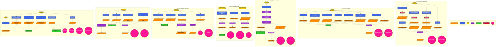

```mermaid
flowchart TB
    classDef event fill:#FF8C00,stroke:#333,stroke-width:2px,color:#000
    classDef command fill:#4169E1,stroke:#333,stroke-width:2px,color:#fff
    classDef actor fill:#FFD700,stroke:#333,stroke-width:2px,color:#000
    classDef policy fill:#9932CC,stroke:#333,stroke-width:2px,color:#fff
    classDef readmodel fill:#32CD32,stroke:#333,stroke-width:2px,color:#000
    classDef external fill:#DC143C,stroke:#333,stroke-width:2px,color:#fff
    classDef hotspot fill:#FF1493,stroke:#333,stroke-width:3px,color:#fff

    subgraph Legenda
        direction TB
        LEG_E[/"Zdarzenie domenowe"/]:::event
        LEG_C["Polecenie"]:::command
        LEG_A(["Aktor"]):::actor
        LEG_P{{"Polityka"}}:::policy
        LEG_R[["Model odczytu"]]:::readmodel
        LEG_EX>"System zewnetrzny"]:::external
        LEG_H(("Hot Spot")):::hotspot
    end

    subgraph CTX1["KONTEKST: Rejestracja i Uwierzytelnianie"]
        direction TB
        User1(["Uzytkownik"]):::actor
        EmailService>"Serwis Email"]:::external
        Facebook>"Facebook OAuth"]:::external
        Strava>"Strava OAuth"]:::external
        
        RegCmd["Zarejestruj sie przez email"]:::command
        VerifyCmd["Zweryfikuj email"]:::command
        FBRegCmd["Zarejestruj przez Facebook"]:::command
        StravaRegCmd["Zarejestruj przez Strava"]:::command
        LoginCmd["Zaloguj sie"]:::command
        
        EmailSent[/"Email weryfikacyjny wyslany"/]:::event
        UserRegistered[/"Uzytkownik zarejestrowany"/]:::event
        FBTokenReceived[/"Token Facebook otrzymany"/]:::event
        FBUserCreated[/"Uzytkownik utworzony przez Facebook"/]:::event
        StravaTokenReceived[/"Token Strava otrzymany"/]:::event
        StravaUserCreated[/"Uzytkownik utworzony przez Strava"/]:::event
        UserLoggedIn[/"Uzytkownik zalogowany"/]:::event
        ActionLogged1[/"Akcja zalogowana"/]:::event
        
        LogPolicy1{{"Loguj kazda akcje"}}:::policy
        
        HS1(("Obsluga nieudanej weryfikacji email")):::hotspot
        HS2(("Konflikt kont Facebook i Strava")):::hotspot
        
        User1 --> RegCmd
        RegCmd --> EmailService
        EmailService --> EmailSent
        EmailSent --> VerifyCmd
        VerifyCmd --> UserRegistered
        
        User1 --> FBRegCmd
        FBRegCmd --> Facebook
        Facebook --> FBTokenReceived
        FBTokenReceived --> FBUserCreated
        
        User1 --> StravaRegCmd
        StravaRegCmd --> Strava
        Strava --> StravaTokenReceived
        StravaTokenReceived --> StravaUserCreated
        
        User1 --> LoginCmd
        LoginCmd --> UserLoggedIn
        
        UserRegistered --> LogPolicy1
        FBUserCreated --> LogPolicy1
        StravaUserCreated --> LogPolicy1
        UserLoggedIn --> LogPolicy1
        LogPolicy1 --> ActionLogged1
    end

    subgraph CTX2["KONTEKST: Profil Uzytkownika"]
        direction TB
        User2(["Uzytkownik"]):::actor
        
        UpdatePersonalCmd["Uzupelnij dane personalne"]:::command
        AddSportCmd["Dodaj kategorie sportowa"]:::command
        SetSkillLevelCmd["Ustaw poziom zaawansowania"]:::command
        SetLocationCmd["Ustaw lokalizacje"]:::command
        SetRadiusCmd["Ustaw promien wyszukiwania"]:::command
        ChangeStatusCmd["Zmien status dostepnosci"]:::command
        
        PersonalDataUpdated[/"Dane personalne zaktualizowane"/]:::event
        SportCategoryAdded[/"Kategoria sportowa dodana"/]:::event
        SkillLevelSet[/"Poziom zaawansowania ustawiony"/]:::event
        LocationSet[/"Lokalizacja ustawiona"/]:::event
        SearchRadiusSet[/"Promien wyszukiwania ustawiony"/]:::event
        StatusChangedToInterested[/"Status zainteresowany teraz"/]:::event
        StatusChangedToNotInterested[/"Status niezainteresowany"/]:::event
        ActionLogged2[/"Akcja zalogowana"/]:::event
        UpdateDistanceCmd["Zaktualizuj dystans"]:::command
        DistanceUpdated[/"Dystans zaktualizowany"/]:::event

        User2 --> UpdateDistanceCmd
        UpdateDistanceCmd --> DistanceUpdated
        DistanceUpdated --> ProfileRM
        
        ProfileRM[["Podglad profilu"]]:::readmodel
        LogPolicy2{{"Loguj kazda akcje"}}:::policy
        
        HS3(("Walidacja poziomu 30km vs 100km")):::hotspot
        HS4(("Maksymalny promien wyszukiwania")):::hotspot
        
        User2 --> UpdatePersonalCmd
        UpdatePersonalCmd --> PersonalDataUpdated
        
        User2 --> AddSportCmd
        AddSportCmd --> SportCategoryAdded
        
        User2 --> SetSkillLevelCmd
        SetSkillLevelCmd --> SkillLevelSet
        
        User2 --> SetLocationCmd
        SetLocationCmd --> LocationSet
        
        User2 --> SetRadiusCmd
        SetRadiusCmd --> SearchRadiusSet
        
        User2 --> ChangeStatusCmd
        ChangeStatusCmd --> StatusChangedToInterested
        ChangeStatusCmd --> StatusChangedToNotInterested
        
        PersonalDataUpdated --> ProfileRM
        SportCategoryAdded --> ProfileRM
        SkillLevelSet --> ProfileRM
        LocationSet --> ProfileRM
        SearchRadiusSet --> ProfileRM
        
        PersonalDataUpdated --> LogPolicy2
        SportCategoryAdded --> LogPolicy2
        StatusChangedToInterested --> LogPolicy2
        StatusChangedToNotInterested --> LogPolicy2
        LogPolicy2 --> ActionLogged2
    end

    subgraph CTX3["KONTEKST: Wyszukiwanie i Dopasowanie"]
        direction TB
        User3(["Uzytkownik"]):::actor
        
        SearchUsersCmd["Wyszukaj uzytkownikow"]:::command
        
        FilterPolicy1{{"Filtruj status zainteresowany"}}:::policy
        FilterPolicy2{{"Filtruj w promieniu geograficznym"}}:::policy
        FilterPolicy3{{"Filtruj wspolne sporty i poziom"}}:::policy
        LogPolicy3{{"Loguj kazda akcje"}}:::policy
        
        UsersFound[/"Uzytkownicy znalezieni"/]:::event
        NoUsersFound[/"Brak pasujacych uzytkownikow"/]:::event
        ActionLogged3[/"Akcja zalogowana"/]:::event
        
        MatchListRM[["Lista dopasowanych uzytkownikow"]]:::readmodel
        
        HS5(("Algorytm dopasowania poziomow")):::hotspot
        HS6(("Czestotliwosc aktualizacji lokalizacji")):::hotspot
        
        User3 --> SearchUsersCmd
        SearchUsersCmd --> FilterPolicy1
        FilterPolicy1 --> FilterPolicy2
        FilterPolicy2 --> FilterPolicy3
        FilterPolicy3 --> UsersFound
        FilterPolicy3 --> NoUsersFound
        
        UsersFound --> MatchListRM
        
        UsersFound --> LogPolicy3
        NoUsersFound --> LogPolicy3
        LogPolicy3 --> ActionLogged3
    end

    subgraph CTX4["KONTEKST: Zaproszenia na Trening"]
        direction TB
        Sender(["Uzytkownik wysylajacy"]):::actor
        Receiver(["Uzytkownik odbierajacy"]):::actor
        
        SendInviteCmd["Wyslij zaproszenie na trening"]:::command
        AcceptCmd["Akceptuj zaproszenie"]:::command
        RejectCmd["Odrzuc zaproszenie"]:::command
        
        InviteSent[/"Zaproszenie wyslane"/]:::event
        InviteReceived[/"Zaproszenie otrzymane"/]:::event
        InviteAccepted[/"Zaproszenie zaakceptowane"/]:::event
        InviteRejected[/"Zaproszenie odrzucone"/]:::event
        ResponseReceived[/"Odpowiedz otrzymana"/]:::event
        ActionLogged4[/"Akcja zalogowana"/]:::event
        
        NotifyPolicy{{"Powiadom odbiorce"}}:::policy
        NotifySenderPolicy{{"Powiadom wysylajacego"}}:::policy
        LogPolicy4{{"Loguj kazda akcje"}}:::policy
        
        InviteListRM[["Lista zaproszen"]]:::readmodel
        
        HS7(("Limit zaproszen dziennie")):::hotspot
        HS8(("Czas waznosci zaproszenia")):::hotspot
        HS9(("Blokowanie spamu")):::hotspot
        
        Sender --> SendInviteCmd
        SendInviteCmd --> InviteSent
        InviteSent --> NotifyPolicy
        NotifyPolicy --> InviteReceived
        InviteReceived --> InviteListRM
        
        Receiver --> AcceptCmd
        AcceptCmd --> InviteAccepted
        
        Receiver --> RejectCmd
        RejectCmd --> InviteRejected
        
        InviteAccepted --> NotifySenderPolicy
        InviteRejected --> NotifySenderPolicy
        NotifySenderPolicy --> ResponseReceived
        
        InviteSent --> LogPolicy4
        InviteAccepted --> LogPolicy4
        InviteRejected --> LogPolicy4
        LogPolicy4 --> ActionLogged4
    end

    subgraph CTX5["KONTEKST:  Administracja Uzytkownikami"]
        direction TB
        Admin1(["Administrator"]):::actor
        
        ViewUsersCmd["Wyswietl liste uzytkownikow"]:::command
        ViewUserDetailsCmd["Wyswietl dane uzytkownika"]:::command
        BlockUserCmd["Zablokuj uzytkownika"]:::command
        UnblockUserCmd["Odblokuj uzytkownika"]:::command
        
        UsersListViewed[/"Lista uzytkownikow wyswietlona"/]:::event
        UserDetailsViewed[/"Dane uzytkownika wyswietlone"/]:::event
        UserBlocked[/"Uzytkownik zablokowany"/]:::event
        UserUnblocked[/"Uzytkownik odblokowany"/]:::event
        UserForcedLogout[/"Uzytkownik wylogowany przymusowo"/]:::event
        ActionLogged5[/"Akcja zalogowana"/]:::event
        
        BlockPolicy{{"Wyloguj zablokowanego uzytkownika"}}:::policy
        LogPolicy5{{"Loguj kazda akcje"}}:::policy
        
        UsersListRM[["Panel uzytkownikow"]]:::readmodel
        
        HS10(("Powod blokady")):::hotspot
        HS11(("Automatyczne odblokowanie")):::hotspot
        
        Admin1 --> ViewUsersCmd
        ViewUsersCmd --> UsersListViewed
        
        Admin1 --> ViewUserDetailsCmd
        ViewUserDetailsCmd --> UserDetailsViewed
        
        Admin1 --> BlockUserCmd
        BlockUserCmd --> UserBlocked
        UserBlocked --> BlockPolicy
        BlockPolicy --> UserForcedLogout
        
        Admin1 --> UnblockUserCmd
        UnblockUserCmd --> UserUnblocked
        
        UsersListViewed --> UsersListRM
        UserDetailsViewed --> UsersListRM
        
        UserBlocked --> LogPolicy5
        UserUnblocked --> LogPolicy5
        LogPolicy5 --> ActionLogged5
    end

    subgraph CTX6["KONTEKST: Zarzadzanie Kategoriami Sportowymi"]
        direction TB
        Admin2(["Administrator"]):::actor
        
        CreateCategoryCmd["Utworz kategorie sportowa"]:::command
        UpdateCategoryCmd["Zaktualizuj kategorie"]:::command
        DeleteCategoryCmd["Usun kategorie"]:::command
        AddSkillLevelCmd2["Dodaj poziom zaawansowania"]:::command
        
        CategoryCreated[/"Kategoria sportowa utworzona"/]:::event
        CategoryUpdated[/"Kategoria zaktualizowana"/]:::event
        CategoryDeleted[/"Kategoria usunieta"/]:::event
        SkillLevelAdded[/"Poziom zaawansowania dodany"/]:::event
        CategoryRemovedFromProfiles[/"Kategoria usunieta z profili"/]:::event
        ActionLogged6[/"Akcja zalogowana"/]:::event
        
        RemoveFromUsersPolicy{{"Usun kategorie z profili uzytkownikow"}}:::policy
        LogPolicy6{{"Loguj kazda akcje"}}:::policy
        
        CategoriesRM[["Lista kategorii sportowych"]]:::readmodel
        
        HS12(("Predefiniowane poziomy per sport")):::hotspot
        HS13(("Co z uzytkownikami przy usunieciu kategorii")):::hotspot
        
        Admin2 --> CreateCategoryCmd
        CreateCategoryCmd --> CategoryCreated
        
        Admin2 --> UpdateCategoryCmd
        UpdateCategoryCmd --> CategoryUpdated
        
        Admin2 --> DeleteCategoryCmd
        DeleteCategoryCmd --> CategoryDeleted
        CategoryDeleted --> RemoveFromUsersPolicy
        RemoveFromUsersPolicy --> CategoryRemovedFromProfiles
        
        Admin2 --> AddSkillLevelCmd2
        AddSkillLevelCmd2 --> SkillLevelAdded
        
        CategoryCreated --> CategoriesRM
        CategoryUpdated --> CategoriesRM
        CategoryDeleted --> CategoriesRM
        
        CategoryCreated --> LogPolicy6
        CategoryUpdated --> LogPolicy6
        CategoryDeleted --> LogPolicy6
        LogPolicy6 --> ActionLogged6
    end

    subgraph CTX7["KONTEKST: Statystyki i Logi"]
        direction TB
        Admin3(["Administrator"]):::actor
        System(["System"]):::actor
        
        ViewDailyStatsCmd["Wyswietl statystyki dzienne"]:::command
        ViewWeeklyStatsCmd["Wyswietl statystyki tygodniowe"]:::command
        ViewMonthlyStatsCmd["Wyswietl statystyki miesieczne"]:::command
        AggregateStatsCmd["Agreguj statystyki"]:::command
        ViewLogsCmd["Wyswietl logi aplikacji"]:::command
        FilterLogsCmd["Filtruj logi"]:::command
        
        DailyStatsViewed[/"Statystyki dzienne wyswietlone"/]:::event
        WeeklyStatsViewed[/"Statystyki tygodniowe wyswietlone"/]:::event
        MonthlyStatsViewed[/"Statystyki miesieczne wyswietlone"/]:::event
        StatsAggregated[/"Statystyki zagregowane"/]:::event
        LogsViewed[/"Logi wyswietlone"/]:::event
        LogsFiltered[/"Logi przefiltrowane"/]:::event
        
        StatsRM[["Dashboard statystyk"]]:::readmodel
        LogsRM[["Panel logow KTO CO KIEDY"]]:::readmodel
        
        HS14(("Retencja logow")):::hotspot
        HS15(("Eksport statystyk")):::hotspot
        HS16(("Alerty przy anomaliach")):::hotspot
        HS17(("GDPR anonimizacja logow")):::hotspot
        
        Admin3 --> ViewDailyStatsCmd
        ViewDailyStatsCmd --> DailyStatsViewed
        
        Admin3 --> ViewWeeklyStatsCmd
        ViewWeeklyStatsCmd --> WeeklyStatsViewed
        
        Admin3 --> ViewMonthlyStatsCmd
        ViewMonthlyStatsCmd --> MonthlyStatsViewed
        
        System --> AggregateStatsCmd
        AggregateStatsCmd --> StatsAggregated
        
        Admin3 --> ViewLogsCmd
        ViewLogsCmd --> LogsViewed
        
        Admin3 --> FilterLogsCmd
        FilterLogsCmd --> LogsFiltered
        
        DailyStatsViewed --> StatsRM
        WeeklyStatsViewed --> StatsRM
        MonthlyStatsViewed --> StatsRM
        
        LogsViewed --> LogsRM
        LogsFiltered --> LogsRM
    end
```
